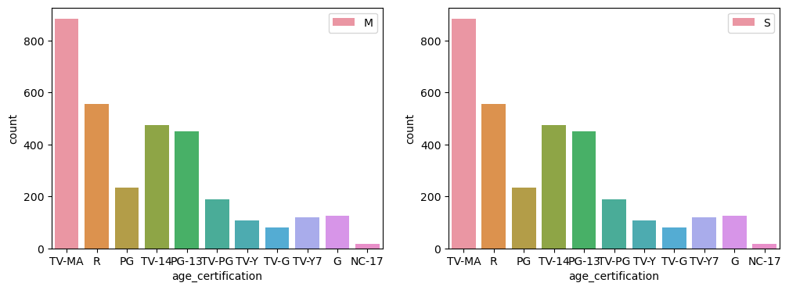
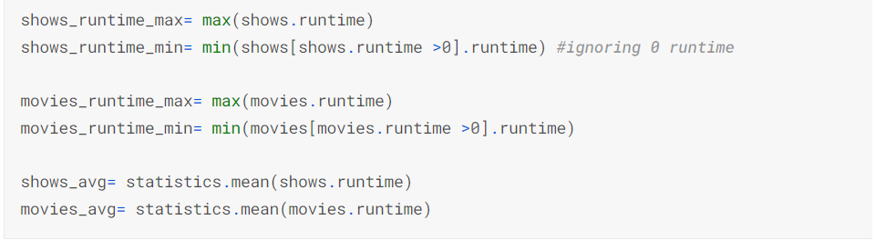
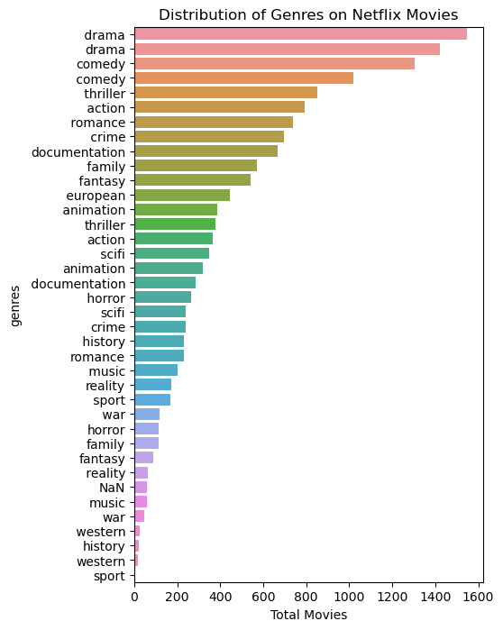
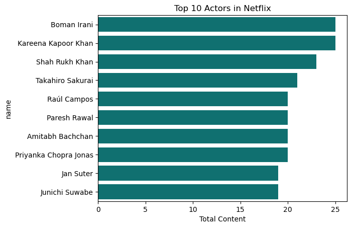
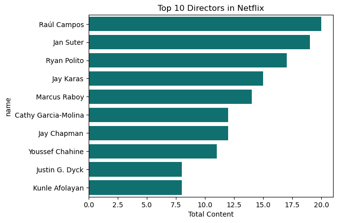

# Netflix-Data-Analysis-using-Python

I'm sharing an Exploratory Data Analysis (EDA) and Data Visualization of Netflix data using Python - A Data Analysis Project performed in my journey into Data Science.

Netflix is an American media company based in Los Gatos, California. Founded in 1997 by Reed Hastings and Marc Randolph. IT is a popular online Streaming service which includes original films and television series commissioned or acquired by the company, and third-party content licensed from other distributors. 

Here, l have explored and quantified data about Netflix Movies, Shows and drawn valuable insights.

* Conducted data cleaning to perform exploratory data analysis (EDA) and data visualization of Netflix dataset using Python (Pandas, NumPy, Matplotlib and Seaborn).

* Data analysis - Exploring the trend of Movies and Shows Production in 21st Century. Also trend of most consumed Genres, Content Ratings, Average runtime of shows and movies in Netflix.

* Use data to identify Top 10 Actors and Directors staring in Netlix movies and Shows.

## Technologies used ⚙️

  Python
  Pandas | NumPy | Matplotlib | Seaborn
  
## Data set

[Kaggle Netlix Dataset](https://www.kaggle.com/datasets/victorsoeiro/netflix-tv-shows-and-movies)

## Objective

1. Total no of Netflix Movies Vs Shows released in 21st centuary

2. Distribution of Netflix movies and shows Film certification 

[(https://www.kaggle.com/code/sangeetharavikumar/netflixanalysis/notebook)

3. Netflix shows and movies content runtime analysis

[(https://www.kaggle.com/code/sangeetharavikumar/netflixanalysis/notebook)

4. Genere Analysis of Netflix movies and shows

[(https://www.kaggle.com/code/sangeetharavikumar/netflixanalysis/notebook)

[(https://www.kaggle.com/code/sangeetharavikumar/netflixanalysis/notebook)

5. Top 10 Actors in Netflix

[(https://www.kaggle.com/code/sangeetharavikumar/netflixanalysis/notebook)

6. Top 10 Directors in Netflix

[(https://www.kaggle.com/code/sangeetharavikumar/netflixanalysis/notebook)
